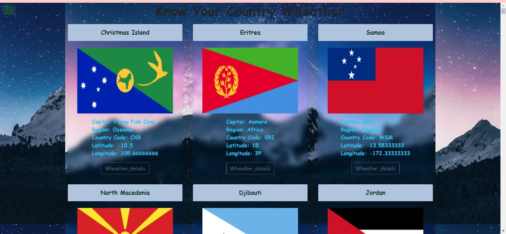
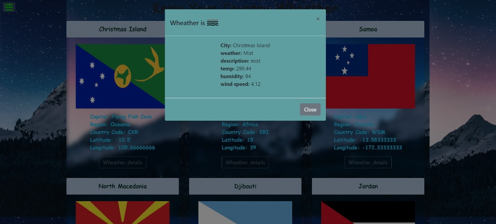
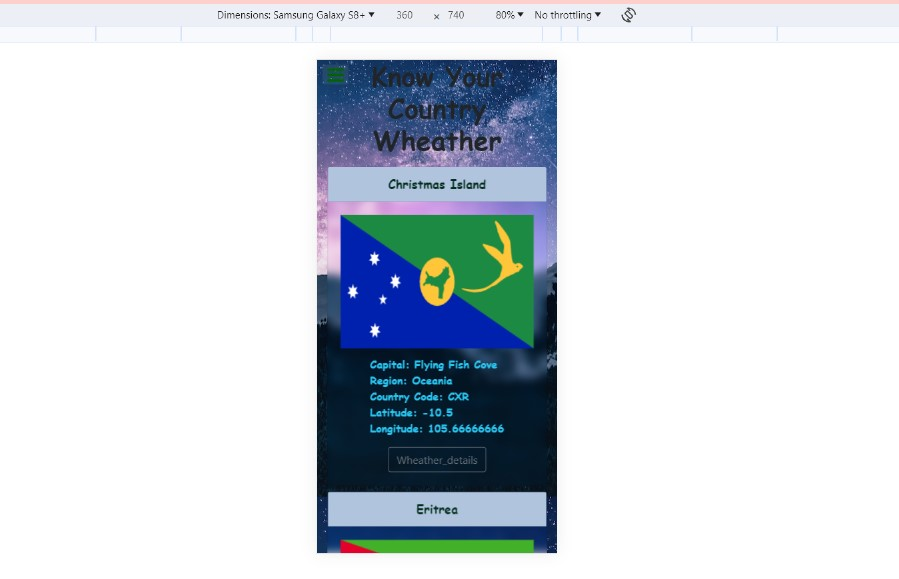

<h1>Rest Countries and Wheather data</h1>

  <h3>DOM: </h3>Created Complete HTML elements in DOM.
  <h3>Rest countries api:</h3>Used fetch method to get the data response from the all countries in rest api.
<h3>Wheather api:</h3> passes the values from rest countries data as a input to the Wheather api to get the wheather details of specific country

<h3>Learned & Used</h3>
<ul>
    <li>Fetch()method<</li>
    <li>DOM nested elements creation</li>
    <li>Css properties</li>
    <li>Glass morphisom</li>
    <li>click events</li>
    <li>JQuery modal.show</li>
  </ul>
<h2>And my output will be with responsivnes</h2>

